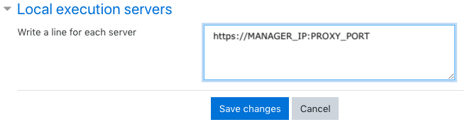
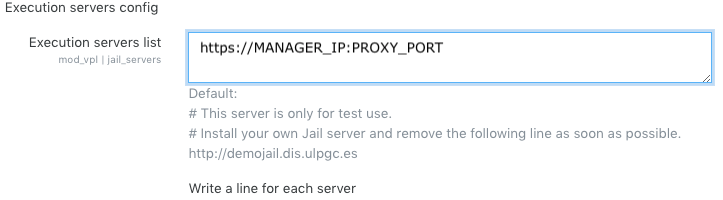

# VPLBDX A PYTHON/DOCKER JAIL SYSTEM FOR VPL 1.0


The VPLBDX project is an alternative execution sandbox to the [VPL-Jail-System](https://github.com/jcrodriguez-dis/vpl-xmlrpc-jail) provided for the [VPL Moodle plugin](https://github.com/jcrodriguez-dis/moodle-mod_vpl). This solution is based on docker swarm, docker containers and a python proxy allowing interactive execution both textual and graphical, and non-iterative execution for code evaluation purpose.

For more details about VPL, visit the [VPL home page](http://vpl.dis.ulpgc.es). The main benefit of this project is to be able to define a personalised sandbox environment for each VPL activity based on a minimal docker image called [gblin/minivpl](https://hub.docker.com/r/gblin/minivpl).

# Requirements
 

Since VPLBDX relies only on docker, it should only requires a system able to run [docker](https://docs.docker.com/install/).

In order to take into account different use case, we designed a solution based on [docker swarm](https://docs.docker.com/engine/swarm/) that deploys jails as services in order to be able to scale up to your needs.

Roughly, in a docker swarm, you may use as much (or as few) machine that you want in a transparent manner. One of them will be the swarm manager and the others will be workers. Services will be deployed on all the machine of the swarm and will be able to communicate through an  overlay network. 

The proxy will be in charge of receiving VPL requests and transfering - using load balancing - the request to one of the vpljail service running on the swarm. Including a specific execution file called **vplbdx.conf** in the VPL activity (details provided afterwards), the corresponding assigned vpljail service will pull - if needed - the requested docker image from [docker hub](https://hub.docker.com/) on the swarm and will execute the VPL executions files into this last ; allowing fine tuning of each VPL activity. 


# Installation

On each machine you want to use in the swarm, you should install [docker](https://docs.docker.com/install/).

In the following, we consider that the manager machine is called **manager** and the workers are **worker1** and **worker2**.
On **manager**, get the repository content:

```shell
    git clone https://github.com/GuillaumeBlin/vplbdx.git 
````

Edit the **.env** file at the root of the project 

```shell
    PROXY_PORT=8090       #Socket port number to listen for secure connections (https: and wss:) for the proxy
    MAXTIME=600           #Maximum time for a request in second
    MAXFILESIZE=64000000  #Maximum file size in bytes
    MAXMEMORY=2000000     #Maximum memory size in bytes
    MAXPROCESSES=500      #Maximum number of processes
    MAXBODYSIZE=1024**2*5 #Maximum size of any html request between moodle platform and the jail service
```

The **manager** machine should have two files regarding your certificate with the following exact path

```shell
/vplbdx/ssl/secure.crt # Your ssl_certificate
/vplbdx/ssl/secure.key # Your ssl_certificate_key
````
Then call the deploy script passing as arguments workers hostnames

```shell
    ./deploy.sh worker1 worker2
````

Everything should be up and running with the current host as **manager** and **worker1** and **worker2** as workers. By default, **4** replicas of the service **vplbdx** are launched on the swarm. You may tune this number by replacing **4** in the line **replicas: 4** of the **docker-compose.yml** file by the desired number of replicas.


# Interrupting the service
Just run the **stopservices.sh** script on the **manager** that will make all nodes leaving the swarm, remove the overlay network and stop all services. 

```shell
    ./stopservices.sh
````

# Pluging the VPLBDX jail system to VPL 

We recommand you to set up a proxy on the moodle server that will be the only one communicating with the VPLBDX jail system (see afterwards).

Otherwise, you just need to set the URL of the execution server in the general module configuration or in the local execution server settings of your Moodle server to

```shell
https://MANAGER_IP:PROXY_PORT/
````
where `MANAGER_IP` is a public ip to access the **manager** machine and `PROXY_PORT` is the value you set in the `.env` file.
**Note that for security purpose, only secured connections are allowed one you use VPLBDX jail system.**





## Setting up a proxy on the moodle server as uniq entry point

In the VPL architecture, the client is connecting directly to the Jail system using websockets. For ease of lisibility, security and simplicity, as we pointed out, we recommand setting a proxy on the moodle server in order to have a uniq point of communication (the client will only refers to your moodle platform). You may then forbid any connection to your **manager** machine other than the one from your moodle platform. 

Moodle platform is often deployed combined with an apache proxy. Configuring this one may be painful regarding websocket handling. This is why we suggest that you install [nginx](https://www.nginx.com/) on your moodle server and put a web proxy up and running on a given port (`4443` here for example) using the following `nginx.conf` file:

```shell
worker_processes auto;

events {
	worker_connections 768;
}

http {
  sendfile on;
  map $http_upgrade $connection_upgrade {
    default upgrade;
    '' close;
  } 
  
  server {
    client_body_buffer_size 500M;
    client_max_body_size 500M;
    
    listen 4443 ssl;    
    ssl_certificate     secure.crt;
    ssl_certificate_key secure.key;
    error_log  /var/log/nginx.log error;

   location / {
      set $upstream MANAGER_IP:PROXY_PORT;
      proxy_pass         https://$upstream;
      proxy_redirect     off;
      proxy_set_header   Host $host;
      proxy_http_version 1.1;
      proxy_set_header   X-Real-IP $remote_addr;
      proxy_set_header   X-Forwarded-For $proxy_add_x_forwarded_for;
      proxy_set_header   X-Forwarded-Host $server_name;
      proxy_set_header Upgrade $http_upgrade;
      proxy_set_header Connection "Upgrade";
      proxy_ignore_client_abort on;
      # VNC connection timeout
      proxy_read_timeout 900s;
      # Disable cache
      proxy_buffering off;
   }
 }
}
````

Once again, you will have to replace `MANAGER_IP` and `PROXY_PORT` such that `MANAGER_IP` is an ip for **manager** machine that is *accessible only* (if you want to straighten the security - *accessible* if you do not care) from the moodle server and `PROXY_PORT` is the value you set in the `.env` file. Moreover, your certifacte files (here `secure.crt` and `secure.key`) should be present in `/etc/nginx/` folder.

The URL of the execution server in the configuration will then be

```shell
https://MOODLE_IP:4443
````

where `MOODLE_IP` is the public ip to access to your moodle platform (note that the port `4443`may be changed by modifying `listen 4443 ssl;` line accordingly).

# Design an activity with your personal docker image

When designing your VPL activity on your moodle platform, just add an execution file called `vplbdx.cfg`which should contain a line in the following format 

```shell
DOCKER=<image-name>
```` 
where `<image-name>` is the name of a docker image available on the docker hub. 

For example:
```shell
DOCKER=gblin/minivpljava
````

## The easy way

For sake of performance, a part of the jail service should be embedded into the corresponding image - namely, a websocket proxy able to pipe the moodle VPL `term.js` client to the shell of the docker and a websocket proxy handling noVNC communications.

We built a minimal docker image, based on [bitami/minideb:stretch](https://hub.docker.com/r/bitnami/minideb/), called [gblin/minivpl](https://hub.docker.com/r/gblin/minivpl) that embeds [wss-shell](misc/docker-images/minivpl/wss-shell/) (a standalone and secured version of [websocket-shell-service](https://www.npmjs.com/package/websocket-shell-service) project based on [Node.js](https://nodejs.org/)), [websockify](https://github.com/novnc/websockify) proxying a [tightvncserver](https://www.tightvnc.com/). 

The simple manner is thus to build your own docker image inheriting from `gblin/minivpl` one. 

For example, [gblin/minivpljava](https://hub.docker.com/r/gblin/minivpljava) docker image is defined only with the following [Dockerfile](https://docs.docker.com/engine/reference/builder/) :

```shell
FROM gblin/minivpl
RUN install_packages openjdk-8-jdk junit openjfx
RUN install_packages locales-all libva-glx1 
````

## The Frank Sinatra way

If you want to do it "your way", you need to design a docker image that will have at least two bash scripts `/vplbdx/start-vncserver.sh` and `/vplbdx/vpl_terminal_launcher.sh` that will be in charge respectively of handling `noVNC` and `term.js` requests using websockets. A nice starting point would be to study the `gblin/minivpl` source files provided in [misc/docker-images/minivpl](misc/docker-images/minivpl/) directory for your information. 

# Troubleshooting

You can obtain logs of the different dockers using ```docker exec <container-id> cat <path_to_log_file>``` command.

For proxy, were ```<tab>``` is a tabulation key pressed to complete container name:

```shell
    docker exec moodpy_proxy.1<tab> cat /var/log/nginx.log
````

For jails, were ```<num>``` is the number of the replica of the service (e.g. 1, 2, ...) and ```<tab>``` is a tabulation key pressed to complete container name:

```shell
    docker exec moodpy_vplbdx.<num>.<tab> cat WS.log HTTP.log
````

